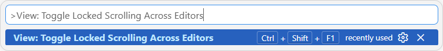

# Translating Phonalyser

Phonalyser's UI strings live in Java *properties* files, one per language, under
[`src/main/resources/i18n/`](src/main/resources/i18n/):

| File | Language |
|------|----------|
| `messages.properties` | English (base — the master key list) |
| `messages_de.properties` | German |
| `messages_uk.properties` | Ukrainian |

**Every locale keeps the same keys on the same line numbers.** A given key sits
on the *same line* in every file, so translations stay aligned and a missing or
extra line is easy to spot. Don't reorder, insert, or delete lines in one file
only — keep all locales in lockstep, and add any new string to *every* file on
the same line.

That line-for-line alignment is what makes the side-by-side trick below work.

## Editing two languages side-by-side in VS Code

Open English on the left and the target language on the right, then **lock the
two editors' scrolling together** so each English line stays next to its
translation as you scroll.

1. Open the English base file `src/main/resources/i18n/messages.properties`.
2. Press **`Ctrl`+`\`** to split the editor — a second pane opens to the right
   (showing the same file for now).
3. In the **right** pane, open the language file you want to edit, e.g.
   `messages_de.properties` (press `Ctrl`+`P` and type the name).
4. Click in each pane and scroll both to the very top (`Ctrl`+`Home`) so they
   start aligned.
5. Press **`Ctrl`+`Shift`+`P`** and run **`View: Toggle Locked Scrolling Across
   Editors`**. Both panes now scroll together — English on the left, its
   translation on the right, line for line.
   - **Tip:** in the command palette, click the ⚙ next to that command to assign
     a keyboard shortcut (the author uses `Ctrl`+`Shift`+`F1`).
6. Run the same command again to turn the lock off.

While locked, edit the value on the **right** (the translation) using the
**left** (English) as the reference — and never add or remove a line on one side
only, or the two files drift out of alignment.

## Help pages

The in-app help is HTML, one tree per language under
`src/main/resources/help/<lang>/`. Those are translated **file by file** (they're
not line-aligned like the properties); keep the same page set and the same image
references across all languages.
