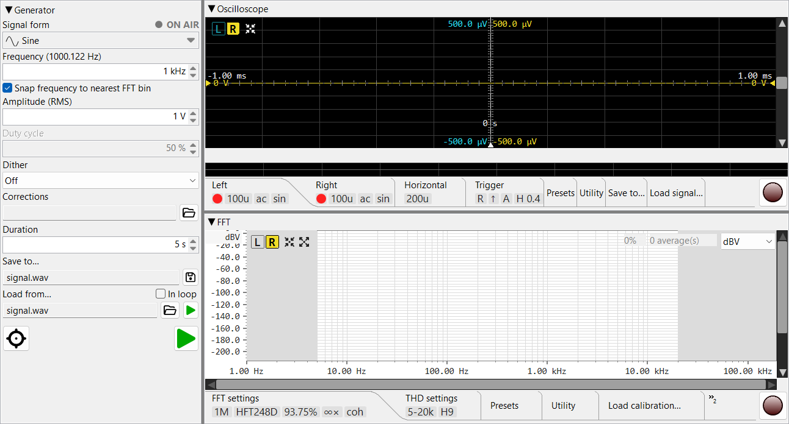
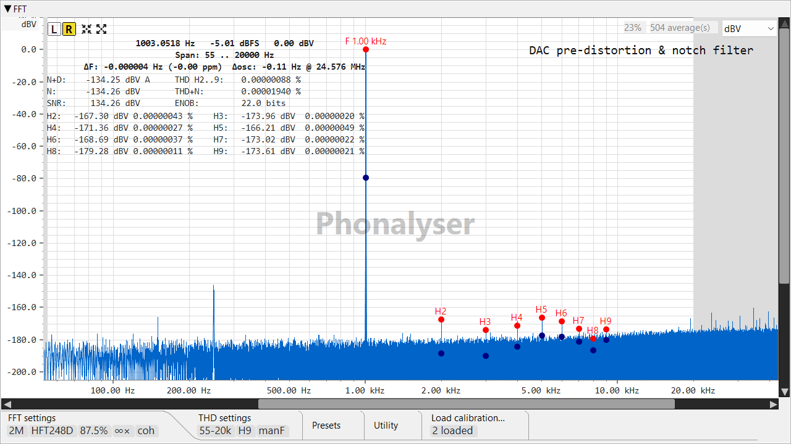

# Phonalyser

**Precision audio measurement workbench** — a desktop analyzer for THD/IMD, SNR/ENOB,
frequency response, and oscilloscope-style inspection, built around coherent FFT
averaging and bit-exact playback/capture.

## Highlights

- **FFT analyzer** — THD, THD+N, IMD, SNR, ENOB, per-harmonic readout, coherent
  averaging, selectable windows, and live calibration (`.frc`).
- **Ultra-low-distortion measurements** — sub-ppm THD with a capable ADC/DAC
  (e.g. E1DA Cosmos), coherent averaging to pull the noise floor down.
- **Oscilloscope** — triggered time-domain view with Vpp/Vrms/period/frequency stats.
- **Frequency response** — log-sweep / multitone with deconvolution and calibration.
- **Signal generator** — sine, dual-tone (IMD), sweep, DDS, with DAC predistortion.
- **Multi-backend audio** — WASAPI & WDM-KS (Windows), CoreAudio (macOS),
  JavaSound (Linux); high sample rates and 16/24/32-bit.

## Preferences & log place

Phonalyser never writes inside its install directory (a packaged `.app`,
`Program Files`, or a system package is read-only). Preferences and logs live in
the per-user location for each OS:

| OS | Preferences | Logs |
|----|-------------|------|
| **Windows** | `%APPDATA%\Phonalyser\` | `%APPDATA%\Phonalyser\logs\` |
| **macOS** | `~/Library/Application Support/Phonalyser/` | `~/Library/Application Support/Phonalyser/logs/` |
| **Linux** | `$XDG_CONFIG_HOME/Phonalyser` (or `~/.config/Phonalyser`) | `/var/log/phonalyser` when writable, otherwise `…/Phonalyser/logs` |

Override the base directory with `-Dapp.data.dir=<path>`.

## Translating the UI & help

On first run the packaged app seeds editable copies of the UI strings and the
help pages into the per-user data dir; edit them there and relaunch. The bundled
copies stay as a fallback, so a missing or incomplete file never loses the
built-in text. After an app upgrade, delete the dir to re-seed the new version.

| OS | UI strings (i18n) | Help pages |
|----|-------------------|------------|
| **Windows** | `%APPDATA%\Phonalyser\i18n\` | `%APPDATA%\Phonalyser\help\` |
| **macOS** | `~/Library/Application Support/Phonalyser/i18n/` | `~/Library/Application Support/Phonalyser/help/` |
| **Linux** | `$XDG_CONFIG_HOME/Phonalyser/i18n` | `$XDG_CONFIG_HOME/Phonalyser/help` |

(On Linux `$XDG_CONFIG_HOME` defaults to `~/.config`.) UI strings are
`messages_<lang>.properties` (e.g. `messages_de.properties`); help pages live
under `help/<lang>/`.

## Build & run

Requires JDK 17 and Maven. See [BUILD.md](BUILD.md) for build and run
instructions, [PACKAGING.md](PACKAGING.md) for per-platform packaging (jpackage),
and [HOWTO-RELEASE.md](HOWTO-RELEASE.md) for the release process.

## License

GNU Affero General Public License v3.0 — see [LICENSE](LICENSE).
