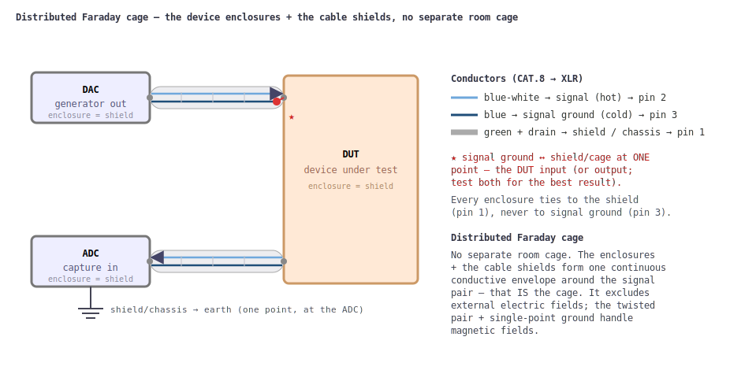

# Faraday-cage measurement bench — wiring against induced noise

Sub-ppm THD and −150 dBV noise floors only mean something if the *wiring* between
the parts of the bench does not inject more noise than the DUT produces. This
note describes how the generator (DAC), the device under test (DUT) and the
capture (ADC) are connected so that external electromagnetic fields induce as
little voltage as possible on the **signal** and **signal-ground** wires.

There is **no separate room-sized cage**. The **device enclosures and the cable
shields together build one continuous conductive envelope** around the signal
pair — a *distributed* Faraday cage, all tied through XLR pin 1 and earthed at a
single point. Three ideas do the work:

1. **Best-possible cable shielding**, with the right wire used for the right job.
2. **A continuous shield/chassis envelope** — the distributed cage — that
   excludes external electric fields.
3. **Single-point grounding**: the signal ground is bonded to that shield at
   exactly one place (the DUT), so shield currents never flow in the signal
   return.



---

## 1. The cable: CAT.8 patch cable, not "audio" coax

The single most important choice is the cable. Use a **computer twisted-pair
CAT.8 patch cable** terminated in **XLR** connectors.

CAT.8 carries a **double shield**: an **aluminium/PET foil** wrapped around *each*
twisted pair, plus an overall foil/braid around all four pairs. A foil is a
*continuous, hole-free* screen — unlike the braided shield of a coaxial cable,
which is a mesh full of small openings that leak fields, especially as frequency
rises. The twisted pair itself is the second weapon: twisting makes the loop area
between signal and return tiny and sign-alternating, so a magnetic field induces
nearly equal-and-opposite EMFs in successive twists that cancel.

> **"High-end" audio coax is the wrong tool here.** Much boutique audio cable has
> surprisingly weak shielding (thin or low-coverage braid) and is marketed on
> properties that are insignificant or outright non-existent for a measurement
> bench. Pay for shield coverage and a tight twist, not for the story.

---

## 2. XLR wiring — one pair carries the signal

A standard XLR has three pins: **1 = shield/ground**, **2 = hot/positive**,
**3 = cold/negative**. Here the connection is **unbalanced**, carried on **one
twisted pair**, with the foil/braid used as a separate chassis screen:

| CAT.8 wire | XLR pin | Role |
|------------|:-------:|------|
| **blue-white** | **2** (hot)  | **Signal** |
| **blue**       | **3** (cold) | **Signal ground** (the unbalanced return) |
| **green + green-white + drain** | **1** | **Cable shield** → device chassis |

So the *signal* (pin 2) and the *signal ground* (pin 3) are the **blue/blue-white
twisted pair**; the green pair plus the drain wire are all tied to **pin 1** and
serve only as the shield/chassis screen.


---

## 3. Single-point grounding — the key trick

**Signal ground (pin 3) is connected to the shield (pin 1) at exactly one place,
normally the DUT input or output — test both and keep whichever gives the lower
noise.** Everywhere else the signal-ground wire is *isolated* from the shield and
from the chassis.

Why this matters: if the signal ground also acted as the shield (as it does in an
ordinary single-ended coax), then any current the external field induces in the
shield would flow *through the signal return* and add directly to the signal at
the DUT input. By giving the shield its own conductor (pin 1, bonded to every
chassis) and bonding the signal ground to it at **one** point only, the
shield/eddy currents have their own return path and **do not** appear in series
with the signal.

**Each device has its own shield connected to the XLR shield/ground (pin 1) — not
to signal ground (pin 3).** The chassis screens form one continuous shield held at
cage/earth potential; the signal ground floats on the twisted pair and touches
that shield only at the single star point at the DUT.

---

## 4. How much noise is actually left? (order-of-magnitude)

The remaining question is whether external fields can still induce a meaningful
voltage. Estimate it.

**Electric fields** — the usual source of mains hum via capacitive coupling — are
**excluded entirely** by the continuous shield/chassis envelope: the foil around
the pair and the metal enclosures form one closed conductor around the signal.
That coupling path is gone.

**Magnetic fields** are not blocked by an electrostatic screen; they have to be
*out-run* by minimising loop area. The thin conductive envelope still helps a
little: the external AC field drives **eddy currents** in the shield/chassis
walls, and those currents radiate a weaker, opposing field, so the residual field
inside is some dB below the outside field. But the external field in an ordinary
room is already small, the eddy current it drives is small, and the field that
current re-radiates is smaller still — so the dominant defence is simply the
**tiny loop area** of the twisted pair.

Faraday's law gives the induced EMF in the signal loop:

```
V = ω · B · A_eff          ω = 2π·f
```

| Quantity | Symbol | Estimate (50 Hz) |
|----------|:------:|------------------|
| Ambient mains magnetic field in a normal room [1] | B_ext | ~0.1 µT (≈1 mG); 0.05–1 µT |
| Residual field inside the cage | B_in | a few dB lower, ~0.05 µT |
| Effective loop area of the twisted pair (pessimistic) | A_eff | ~10 mm² = 1×10⁻⁵ m² |
| Angular frequency | ω | 2π·50 ≈ 314 rad/s |
| **Induced EMF** | **V** | **314 · 5×10⁻⁸ · 1×10⁻⁵ ≈ 1.6×10⁻¹⁰ V ≈ 0.16 nV** |
| in dBV (re 1 V) | | **≈ −196 dBV** |

Even taking a deliberately pessimistic case — no envelope attenuation (B = 0.1 µT)
and a poorly-twisted run with ten times the loop area (A_eff = 100 mm²):

```
V = 314 · 1×10⁻⁷ · 1×10⁻⁴ ≈ 3×10⁻⁹ V ≈ 3 nV ≈ −170 dBV
```

That is still **tens of dB below the converter's own noise floor** (a capable ADC
sits around −150…−160 dBV per bin). The magnetically-induced mains pickup is
negligible.

For contrast, drop the discipline — let the signal-ground conductor double as the
shield so the *whole* cable-to-chassis loop (tens of cm²) is exposed and carries
shield current — and the same field induces **micro-volts** (≈ −120 dBV): audible
hum, and a hard floor under every distortion measurement. **The twist plus
single-point ground buys roughly 50–80 dB.**

---

## Example DUTs

The same wiring feeds whatever sits in the cage. Two filters used on this bench:

| Twin-T 1 kHz notch | Anti-RIAA filter |
|---|---|
|  |  |


---

## Summary

- **CAT.8 twisted pair + XLR**, double foil shield, no braid holes.
- **Pin 2 = signal, pin 3 = signal ground, pin 1 = shield/chassis.**
- **Signal ground bonded to shield at one point only**, at the DUT.
- **Every chassis on the shield (pin 1), never on signal ground.**
- This continuous shield/chassis envelope drives the induced mains pickup to
  **≈ −170 dBV or lower** — well under the noise floor of the measurement itself.

---

## References

1. **Ambient mains magnetic field.** World Health Organization,
   *Electromagnetic fields and public health: exposure to extremely low frequency
   (ELF) fields* (fact sheet, 2007): typical residential power-frequency
   (50/60 Hz) background magnetic fields average **≈ 0.07 µT (Europe)** and
   **≈ 0.11 µT (North America)**, rising locally near appliances and wiring. See
   also WHO *Environmental Health Criteria 238 — Extremely Low Frequency Fields*
   (2007), and the U.S. NIEHS/NIH booklet *EMF: Electric and Magnetic Fields
   Associated with the Use of Electric Power* (typical home background
   ≈ 0.5–4 mG = 0.05–0.4 µT).
   <https://www.who.int/news-room/fact-sheets/detail/electromagnetic-fields-and-public-health-exposure-to-extremely-low-frequency-fields>
2. **Shielding & grounding technique.** H. W. Ott, *Electromagnetic Compatibility
   Engineering* (Wiley, 2009), ISBN 978-0-470-18930-6 — Chapter 2 "Cabling", esp.
   §2.12 Coaxial Cable Versus Twisted Pair, §2.13 Braided Shields, and §2.15.2
   Grounding of Cable Shields.
